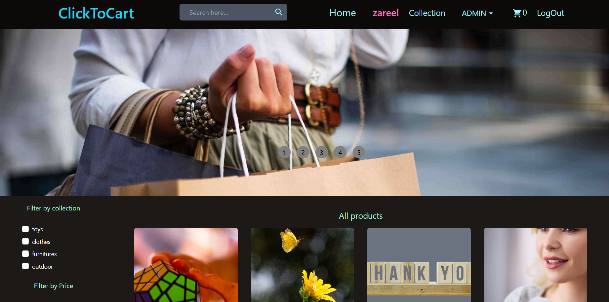
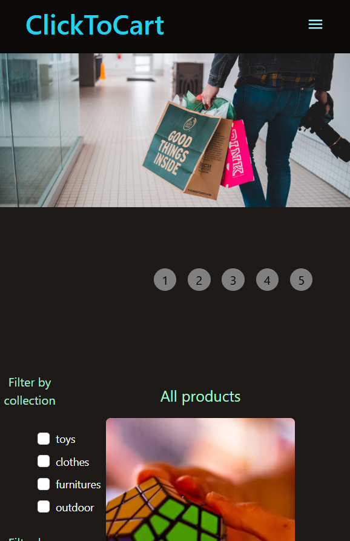

# Head 1
## Head 2
### Head 3
#### List
- project 1
    - assignment1
    - assignment2
    - assignment3
- project 2
- project 3
- project 4

#### ordered list
1. project
2. project
3. project
4. project
5. project

_italics_

[Shopping Cart](https://github.com/Zareel/Shopping-Cart)

[Google](https://www.google.com)

# Flutter Ecomm Website
## This is my fullStack project and .....

### Technologies used
- HTML
- CSS
- JS
- REACT
- NODEJS
- EXPRESS
- MONGODB

[Live @](https://z-interior-disign-landing-page.netlify.app/)

### Screenshots
#### This project is responsive to all types of devices

## Full Screen

## Mobile 
